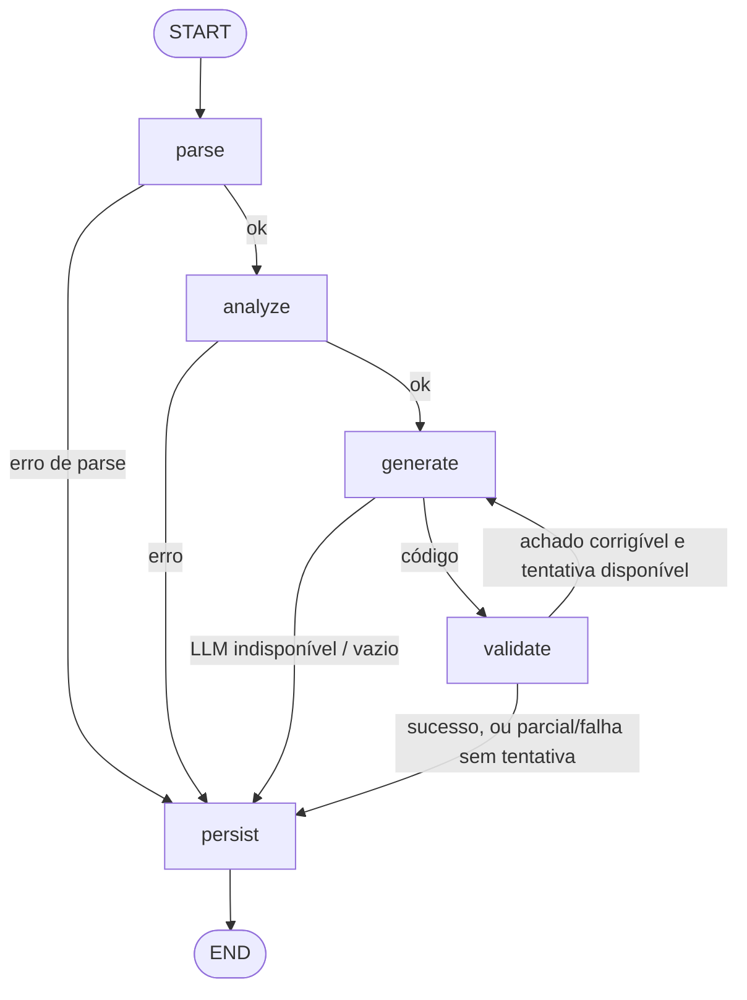
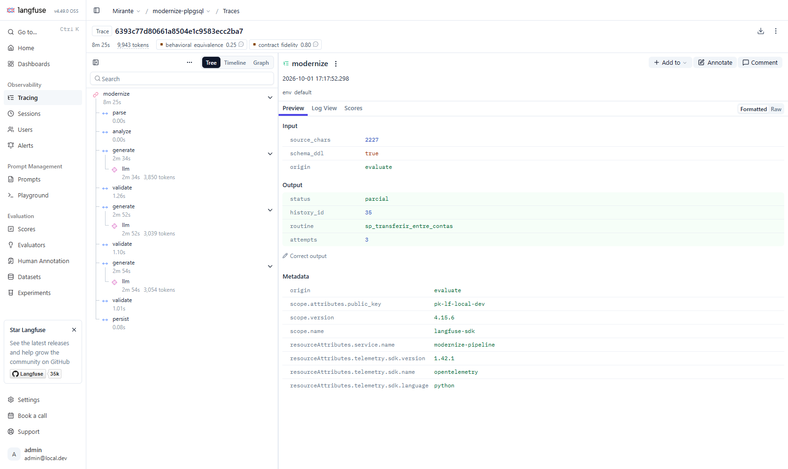
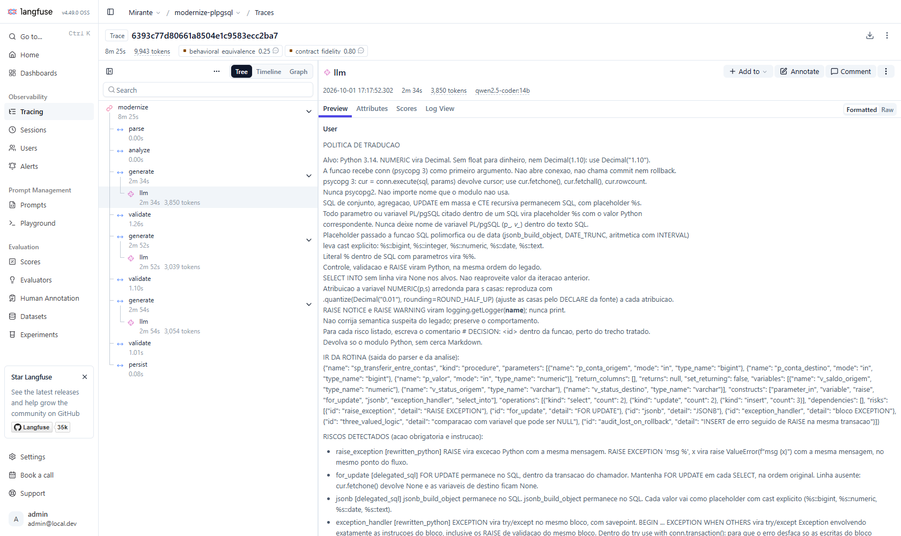
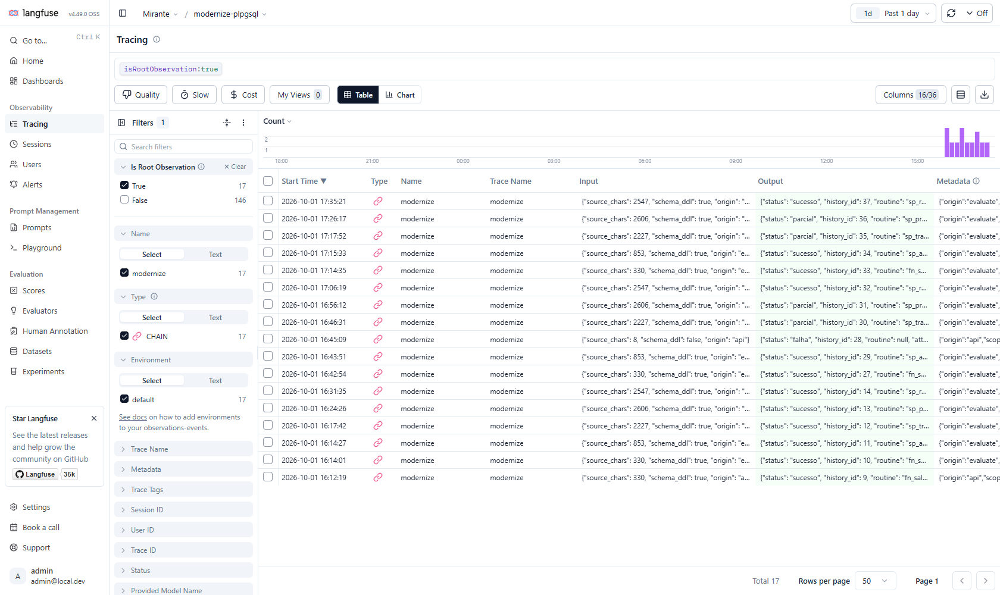

# Pipeline híbrida de modernização PL/pgSQL → Python 3.14

[](https://github.com/Matheusroliv/desafio-tecnico-mirante-tecnologia/actions/workflows/ci.yml)

Recebe o código de uma stored procedure PL/pgSQL (e, opcionalmente, o DDL das tabelas) e devolve um módulo Python 3.14, um relatório das decisões e validações de cada etapa e, quando há banco de teste, a medida de equivalência com a procedure original. A pipeline é híbrida: **parsing, análise semântica, validação, persistência e métricas são determinísticos**; só a **geração** usa LLM, e o prompt é montado a partir das saídas das etapas anteriores.

| Requisito do desafio | Onde está |
| --- | --- |
| Grafo LangGraph com estado tipado (parsing, análise, geração, validação) | [`graph/builder.py`](src/modernize/graph/builder.py), [`graph/state.py`](src/modernize/graph/state.py) |
| Servidor local via **LangGraph CLI** com `POST /modernize` e `GET /health` | [`langgraph.json`](langgraph.json) → [`api/app.py`](src/modernize/api/app.py) |
| PostgreSQL com `modernization_history` (toda execução, qualquer desfecho) | [`db/migrations/001_init.sql`](db/migrations/001_init.sql), [`persistence/history.py`](src/modernize/persistence/history.py) |
| Docker Compose: servidor + PostgreSQL (+ Langfuse) | [`docker-compose.yml`](docker-compose.yml), [`Dockerfile`](Dockerfile) |
| Resultados dos anexos B–F | [`results/`](results/) |
| **Bônus 1** — Langfuse (trace por execução, span por nó, custo/latência do LLM) | [`observability/tracing.py`](src/modernize/observability/tracing.py), profile `observability` do Compose, [captura](#5-observabilidade-langfuse) |
| **Bônus 3** — QA (checagem estática + pytest) | ruff (lint + format), mypy, 121 testes (unitários + integração), cobertura ≥ 85% (atual ~97%), CI no GitHub Actions |
| **Bônus 3** — Métrica de evaluation | Fidelidade de Contrato + **Equivalência Comportamental** contra a procedure original, `POST /evaluate` |

**Início rápido**

```bash
cp .env.example .env                               # preencha OPENAI_API_KEY ou use Ollama (seção 2)
docker compose --profile observability up --build  # API em :2024, Langfuse em :3000
curl http://localhost:2024/health                  # {"status":"ok"}
```

Sem LLM configurado a API sobe normalmente e `POST /modernize` responde `status: "falha"` com parsing e análise preenchidos no relatório. Para ver código gerado, configure a chave ou o Ollama. O exemplo de requisição está na [seção 2](#2-como-executar-e-testar).

**Índice:** [1. Pipeline](#1-a-pipeline-e-o-fluxo-de-modernização) · [2. Como executar e testar](#2-como-executar-e-testar) · [3. Decisões e trade-offs](#3-decisões-técnicas-e-trade-offs) · [4. Banco de dados](#4-banco-de-dados) · [5. Observabilidade](#5-observabilidade-langfuse) · [6. Métricas e resultados](#6-métricas-de-evaluation) · [7. Escalabilidade](#7-escalabilidade-e-evolução) · [8. Limitações](#8-limitações-conhecidas-e-próximos-passos)

---

## 1. A pipeline e o fluxo de modernização



| Nó | Motor | O que faz | Saída no relatório |
| --- | --- | --- | --- |
| `parse` | regras (pglast) | `parse_sql` lê o envelope `CREATE FUNCTION/PROCEDURE` (nome, parâmetros IN/OUT, `RETURNS TABLE`, linguagem); `parse_plpgsql` lê o corpo. Tudo vira um **IR Pydantic** próprio ([`ir/models.py`](src/modernize/ir/models.py)). | `parsing` |
| `analyze` | regras | Caminha o IR e emite **construtos** (cursor, `GET DIAGNOSTICS`, CTE recursiva, ...), **operações** (`select/insert/update/delete/return`), **dependências** (rotinas de usuário) e **riscos** de um catálogo fechado de 15 ids. | `semantic_analysis` |
| `generate` | **LLM** | Monta o prompt com política fixa + IR + riscos com instrução específica + contrato de saída tipado + schema + fonte (+ achados, no reparo). Chama o provedor e copia a tabela de decisões para o relatório. | `generation` |
| `validate` | regras | `ast.parse`, ruff (`E9`,`F`) no código gerado, símbolo e parâmetros, comentário `# DECISION: <risco>` para cada risco e 7 checagens de **política por AST**. Com o banco legado configurado, **executa a rotina original e a gerada lado a lado** (cenários) — a "evolução desejada" do enunciado. Decide `sucesso`/`parcial`/`falha` e se volta ao LLM. | `validation` |
| `persist` | regras | Grava **uma linha por execução** em `modernization_history`, em qualquer desfecho, com `duration_ms` e o `trace_id` do Langfuse. | `meta` |

**Laço de reparo (fluxo de decisão).** Se a validação achar algo objetivo (sintaxe, nome indefinido, `DECISION` faltando, `commit` proibido, `SELECT` dentro do laço do cursor, cenário divergente do legado...), o grafo volta a `generate` com o código anterior e a lista de achados, até `MAX_REPAIR_ATTEMPTS` (padrão 1). Se o reparo piorar o resultado, a tentativa anterior é mantida.

**Status.** `sucesso`: todas as checagens passaram. `parcial`: o código parseia, mas falhou em ruff, símbolo, `DECISION`, política ou em algum cenário de equivalência. `falha`: fonte inválida, LLM indisponível, código vazio ou `ast.parse` falhou depois do último reparo. Fonte vazia/corpo inválido é HTTP 422 e não entra no grafo; o resto é HTTP 200 com o desfecho no campo `status`. HTTP 500 só se o banco cair duas vezes.

### Estrutura do código

```
src/modernize/
  api/            app FastAPI publicado pelo langgraph.json (http.app) + schemas Pydantic
  graph/          StateGraph, roteamento condicional e PipelineState (TypedDict)
  nodes/          um módulo por nó: parse, analyze, generate, validate, persist
  parsing/        pglast -> IR (único módulo que importa pglast)
  ir/             modelos Pydantic do IR
  analysis/       construtos, operações, dependências e riscos (regras)
  generation/     prompt (política + instrução por risco + contrato) e adaptador de LLM
  validation/     ast.parse, ruff, símbolo, DECISION e política por AST
  evaluation/     Fidelidade de Contrato, Equivalência Comportamental (worker em subprocesso), cenários, runner
  persistence/    porta HistoryRepository (Postgres e memória)
  observability/  Langfuse (trace, spans, generation, scores) ou no-op
  pipeline.py     uma execução com trace raiz (usado pela API e pelo runner)
db/               init (databases auxiliares) e migração da modernization_history
fixtures/         anexos A–F (SQL canônico) e massa do banco legado
results/          saída da pipeline para B–F (module.py + report.json)
tests/            pytest; tests/reference/ tem traduções escritas à mão que validam a métrica
docs/             capturas do Langfuse
```

### Catálogo de riscos e política de tradução

A análise marca o risco; a política diz a ação (que vai para o relatório) e a instrução que o LLM recebe — **só para os riscos detectados**. É aqui que a parte determinística dirige a parte probabilística.

| Risco | Detectado em | Ação | Política aplicada |
| --- | --- | --- | --- |
| `cursor_n_plus_1` | E | `rewritten_python` | Uma query materializa o cursor, outra lê as taxas vigentes; casamento em memória. Proibido `SELECT` por linha. |
| `raise_exception` | C D F | `rewritten_python` | `raise ValueError` com a mesma mensagem, no mesmo ponto do fluxo. |
| `for_update` | D | `delegated_sql` | `FOR UPDATE` permanece no SQL, na ordem original. |
| `jsonb` | C D E | `delegated_sql` | `jsonb_build_object` fica no SQL, com casts explícitos nos placeholders. |
| `recursion` | F | `delegated_sql` | `WITH RECURSIVE` fica num único SQL. |
| `get_diagnostics` | C | `rewritten_python` | `cur.rowcount` do `UPDATE`, antes do `INSERT` de auditoria. |
| `out_parameter` | C | `rewritten_python` | `OUT` vira `@dataclass OutParams`. |
| `nested_routine_call` | F | `preserved` | `from modernized.fn_saldo_cliente import fn_saldo_cliente`; chamada com a mesma `conn`. Sem inline. |
| `exception_handler` | D F | `rewritten_python` | `try/except` + `with conn.transaction()` (savepoint, como o bloco PL/pgSQL). |
| `set_returning` | F | `rewritten_python` | `RETURNS TABLE` vira `list[Row]` (dataclass com as colunas). |
| `bulk_update` | C | `delegated_sql` | Um `UPDATE` de conjunto; intervalo com `make_interval(days => %s)`, sem concatenar texto. |
| `three_valued_logic` | D | `preserved` | `NULL <> 'ATIVA'` não é verdadeiro: `(x is not None and x != 'ATIVA')`. |
| `audit_lost_on_rollback` | D | `divergent` | Parâmetro opcional `audit_conn`: se informado, o log de erro sobrevive ao rollback. |
| `date_of_timestamp` | E | `delegated_sql` | `DATE(data_transacao)` fica no SQL (depende do `TimeZone` da sessão). |
| `swallowed_exception` | F | `preserved` | O `except` devolve a linha de fallback e não propaga — inclusive o "período inválido". |

---

## 2. Como executar e testar

### Pré-requisitos

- Docker com Compose v2.
- Um LLM compatível com a API de chat da OpenAI: chave da OpenAI **ou** [Ollama](https://ollama.com) local (sem custo; os resultados versionados usaram `qwen2.5-coder:14b`).
- Para rodar fora do Docker: Python 3.14 (recomendado [`uv`](https://docs.astral.sh/uv/)).

### Subir com Docker Compose

```bash
cp .env.example .env              # preencha OPENAI_API_KEY (ou configure o Ollama, ver abaixo)
docker compose up --build         # Postgres 17 + servidor LangGraph (Python 3.14) em http://localhost:2024

# com observabilidade (Langfuse self-hosted em http://localhost:3000, login admin@local.dev / admin12345):
docker compose --profile observability up --build
```

O Postgres sobe com três databases: `pipeline` (histórico, migração aplicada no init), `legacy` (métrica de equivalência) e `langfuse`. O init só roda com volume vazio; se você tem um volume de uma versão anterior, use `docker compose down -v` uma vez.

Sem o profile `observability`, deixe `LANGFUSE_PUBLIC_KEY` e `LANGFUSE_SECRET_KEY` vazias no `.env`: o tracing vira no-op e o servidor não tenta exportar para um Langfuse que não está no ar.

Ollama no host: no `.env`, `OPENAI_API_KEY=ollama`, `OPENAI_MODEL=qwen2.5-coder:14b`, `OPENAI_EXTRA_BODY={"options":{"num_ctx":16384}}` e `DOCKER_OPENAI_BASE_URL=http://host.docker.internal:11434/v1` (dentro do container, `localhost` é o próprio container).

### Chamar a API

```bash
curl http://localhost:2024/health
# {"status":"ok"}

# POST /modernize com o anexo B e o schema do anexo A como contexto
python -c "import json; r = lambda f: open(f, encoding='utf-8').read(); print(json.dumps({'source_code': r('fixtures/fn_saldo_cliente.sql'), 'schema_ddl': r('fixtures/schema.sql')}))" > b.json
curl -s -X POST http://localhost:2024/modernize -H "Content-Type: application/json" --data-binary @b.json

curl http://localhost:2024/history/1        # linha persistida em modernization_history
curl -X POST http://localhost:2024/evaluate # roda B–F e devolve as duas métricas (5+ chamadas de LLM; com modelo local, prefira o runner abaixo)
```

Resposta de `/modernize` (resumida):

```json
{
  "id": 9,
  "status": "sucesso",
  "generated_code": "import psycopg\nfrom decimal import Decimal\n\ndef fn_saldo_cliente(conn, p_cliente_id: int) -> Decimal: ...",
  "report": {
    "parsing": {"ok": true, "error": null, "routine_name": "fn_saldo_cliente", "routine_kind": "function"},
    "semantic_analysis": {
      "ok": true,
      "constructs": ["parameter_in", "variable", "select_into"],
      "risks": [],
      "operations": [{"kind": "select", "count": 1}, {"kind": "return", "count": 1}],
      "dependencies": []
    },
    "generation": {
      "ok": true, "error": null, "model": "qwen2.5-coder:14b", "attempts": 1,
      "decisions": [{"risk_id": "op:select", "action": "delegated_sql", "rationale": "..."}]
    },
    "validation": {
      "ok": true, "ast_parse_ok": true, "ruff_ok": true, "symbol_ok": true,
      "policy_ok": true, "policy_issues": [],
      "behavioral": {"score": 1.0, "passed": 4, "total": 4},
      "issues": []
    },
    "meta": {"trace_id": "83b6ba24...", "duration_ms": 64513, "pipeline_version": "0.2.0"}
  }
}
```

A documentação interativa (OpenAPI) fica em `http://localhost:2024/docs`, junto com as rotas nativas do LangGraph Server (`/threads`, `/runs`, `/ok`...).

### Rodar fora do Docker

```bash
uv venv --python 3.14 && uv pip install -e ".[dev]"     # ou: python3.14 -m venv .venv && pip install -e ".[dev]"
source .venv/bin/activate                               # Windows: .venv\Scripts\activate
cp .env.example .env                                    # DATABASE_URL e LEGACY_DATABASE_URL já apontam para localhost
docker compose up -d postgres                           # só o banco
langgraph dev --no-browser                              # mesmo servidor, porta 2024
```

### Testes e checagens estáticas (Bônus QA)

```bash
pytest                       # unitários + integração; cobertura com piso de 85% (pytest-cov)
pytest -m "not integration"  # só o que não precisa de Postgres
ruff check src tests && ruff format --check src tests
mypy                         # pacote src/modernize
```

Nenhum teste chama LLM nem serviço externo, e nenhum precisa de chave: o LLM é substituído por fakes. Os testes marcados `integration` usam o Postgres do Compose (`DATABASE_URL`, `LEGACY_DATABASE_URL`) e são **pulados com mensagem** se o banco não responder. O que a suíte cobre:

| Arquivo | Cobre |
| --- | --- |
| `test_parsing_analysis.py` | IR e análise dos 5 anexos contra um "ouro" (parâmetros, tipos, riscos, operações, construtos, dependências); entradas inválidas |
| `test_prompt.py` | prompt não é só a fonte; instrução só para risco detectado; contrato tipado; bloco de reparo; remoção de cerca Markdown |
| `test_validation.py` | `sucesso/parcial/falha`; símbolo/parâmetros/OUT; ruff com linha; cada regra de política (positivo e negativo) |
| `test_graph.py` | os 5 nós com LLM falso; falha de parse, LLM fora, código vazio; reparo que conserta, que piora, que estoura tentativas, LLM que cai no reparo; **reparo guiado pelo banco legado real** (D ingênuo → D correto) |
| `test_api.py` | `/health`, 422 sem gravar, 200 com relatório, 500 com banco fora duas vezes, `/history`, `/evaluate` |
| `test_evaluation.py` | pesos da Fidelidade; normalização/efeito/comparação; worker com falha/timeout; **traduções de referência = 1.0 contra o legado real**; traduções ingênuas (`!=` com NULL, taxa herdada) **< 1.0** |
| `test_persistence.py` | três desfechos no Postgres real, `CHECK` de status, leitura |
| `test_observability_llm.py` | árvore de observações (trace → nós → generation), scores, no-op sem chaves, adaptador OpenAI com uso de tokens |

### Regenerar `results/`

```bash
python -m modernize.evaluation.runner   # roda B–F pela pipeline, grava results/<rotina>/{module.py,report.json} e imprime as métricas
```

### Variáveis de ambiente

| Variável | Uso | Padrão |
| --- | --- | --- |
| `DATABASE_URL` | Postgres do histórico (`pipeline`) | — |
| `LEGACY_DATABASE_URL` | database `legacy` da Equivalência Comportamental; vazio desliga a métrica | — |
| `OPENAI_API_KEY` | chave do provedor; sem ela a geração persiste `falha` | — |
| `OPENAI_BASE_URL` | endpoint compatível (OpenAI, Ollama, vLLM, LiteLLM) | `https://api.openai.com/v1` |
| `OPENAI_MODEL` | modelo de geração | `gpt-4.1` |
| `OPENAI_EXTRA_BODY` | JSON repassado ao provedor (ex.: `num_ctx` do Ollama) | vazio |
| `DOCKER_OPENAI_BASE_URL` | sobrescreve `OPENAI_BASE_URL` só no container | vazio |
| `MAX_REPAIR_ATTEMPTS` | reparos depois da primeira geração | `1` |
| `LANGFUSE_PUBLIC_KEY` / `LANGFUSE_SECRET_KEY` | chaves do projeto Langfuse; vazias desligam o tracing | chaves locais de dev |
| `LANGFUSE_HOST` | URL do Langfuse (no Compose a API usa `http://langfuse-web:3000`) | `http://localhost:3000` no `.env.example` |

---

## 3. Decisões técnicas e trade-offs

### Servidor: LangGraph CLI com `http.app`

O enunciado pede o servidor do **LangGraph CLI** e, ao mesmo tempo, rotas próprias. `langgraph.json` publica o grafo `modernize` e aponta `http.app` para um app FastAPI com `/health`, `/modernize`, `/evaluate` e `/history/{id}` — o mecanismo oficial de rotas customizadas. O handler roda a pipeline ([`pipeline.py`](src/modernize/pipeline.py): trace raiz + `graph.invoke`) em `asyncio.to_thread`, para não bloquear o loop do servidor.

- *Alternativa descartada:* uvicorn + FastAPI direto. Cumpre os paths, descumpre o CLI. O health nativo (`GET /ok`) não substitui `/health`.
- *Dependência:* `langgraph-cli[inmem]` com `langgraph-api>=0.15`. Sem o extra `inmem`, `langgraph dev` aborta com `Required package 'langgraph-api' is not installed`.

### Parser: pglast + IR próprio

pglast embute o parser real do PostgreSQL (libpg_query) e tem `parse_plpgsql`, que entende o corpo procedural (cursor, `EXCEPTION`, `GET DIAGNOSTICS`, `RAISE`, `RETURN QUERY`). A árvore que ele devolve é um dict cru e instável entre versões; por isso **nenhum módulo além de `parsing/parser.py` importa pglast** — o resto enxerga só o IR Pydantic. Os testes de ouro são a rede de proteção para upgrade do pglast.

- *sqlglot:* ótimo para SQL multidialeto, fraco no corpo procedural.
- *sqlparse:* só tokeniza; não estrutura a rotina.
- *regex:* descartado; falha de parse vira `falha` explícita, sem fallback.

### Onde a lógica mora: SQL delegado + controle em Python

Agregação, `UPDATE` em massa e CTE recursiva **continuam SQL**, executados com psycopg 3 na conexão que o chamador passa. Validação, controle de fluxo e exceções viram Python. A função gerada **não abre conexão nem dá `commit`/`rollback`**: o chamador é dono da transação (é assim que o anexo F chama `fn_saldo_cliente` na mesma transação, e que o teste de equivalência roda tudo dentro de um savepoint).

- *Python puro (carregar tabelas e calcular em memória):* aumenta a chance de divergência (arredondamento de `NUMERIC`, `NULL`, fuso de `DATE()`), piora o anexo E se virar N+1 e joga fora o que o PostgreSQL já faz certo.
- *SQLAlchemy:* não traz ganho para SQL que já está escrito e validado; psycopg 3 + placeholders é a menor superfície.
- Dinheiro é `Decimal` (nunca `float`), data é `datetime.date`. A política inclui o arredondamento implícito de `NUMERIC(18,2)` em cada atribuição (`quantize(..., ROUND_HALF_UP)`), que muda o valor da tarifa no anexo E (1.875 → 1.88).

### Decisões por anexo

| Anexo | Decisão | Por quê |
| --- | --- | --- |
| B `fn_saldo_cliente` | uma query, retorna `Decimal` | `COALESCE` garante 0 (não `None`) para cliente sem conta ativa. |
| C `sp_atualizar_status_contas_inativas` | `OutParams` (dataclass) para o `OUT`; `rowcount` do `UPDATE`; `make_interval` | Dataclass é tipada e explícita (tupla esconde nome, dict esconde tipo). `make_interval(days => %s)` evita montar SQL por texto e tem o mesmo efeito para inteiro validado. |
| D `sp_transferir_entre_contas` | `try` + savepoint; lógica de três valores; `audit_conn` opcional | O legado grava o log de erro e dá `RAISE` na mesma transação, então o log **morre no rollback**. A tradução preserva isso por padrão e oferece `audit_conn` para quem quiser o log de verdade (decisão `divergent`, registrada). `NULL <> 'ATIVA'` não dispara o `IF`: com destino inexistente, quem barra é a **FK** de `transacoes` — e a mensagem de erro observável é a da FK. |
| E `sp_processar_lote_taxas` | cursor materializado + taxas numa query + `dict` em memória | Tradução ingênua = 1 + N `SELECT`s de taxa. A pensada faz 2 leituras, preserva "taxa mais recente vigente", "linha sem taxa não herda a anterior" (`SELECT INTO` sem linha zera os alvos) e materializa o conjunto **antes** dos `INSERT` de tarifa (o `OPEN` do cursor fixa o conjunto). Escritas por linha continuam por linha; `executemany` é otimização possível sem mudar efeito. |
| F `sp_relatorio_mensal_cliente` | CTE recursiva intacta; chamada Python a `fn_saldo_cliente`; `logging`; fallback | O `RAISE` de período inválido está no mesmo bloco do `WHEN OTHERS`, então o legado **engole** o erro e devolve a linha de fallback — a tradução faz o mesmo. `saldo_consolidado` não acumula meses (é saldo atual ± movimento do mês): preservado, não "corrigido". `RAISE NOTICE/WARNING` → `logging`. |

### Validação: estática, política por AST e dinâmica contra o legado

O mínimo pedido (`ast.parse` + lint) não pega os erros que importam numa migração. Além de ruff (`E9`,`F`), [`validation/policy.py`](src/modernize/validation/policy.py) verifica no AST: sem `commit/rollback`, sem `connect`, sem `float`, sem `print`, sem SQL montado por f-string/`%`/`.format`/concatenação, sem placeholder sem cast dentro de `jsonb_build_object` (o psycopg 3 envia texto com tipo desconhecido e o PostgreSQL recusa em tempo de execução) e sem `SELECT` dentro de laço quando o risco `cursor_n_plus_1` existe. Violação deixa a execução `parcial` e vira feedback do reparo.

Quando `LEGACY_DATABASE_URL` está configurada e a rotina tem cenários cadastrados, o nó `validate` também roda a [Equivalência Comportamental](#6-métricas-de-evaluation) (subprocesso, timeout) e manda cada cenário divergente para o reparo, com a diferença concreta ("legado levantou `Conta de origem 999 nao encontrada`, o Python não"). Dependência ainda não migrada (o `fn_saldo_cliente` dentro do anexo F) entra como *shim* que chama a função SQL legada — padrão *strangler*, que permite migrar e validar uma rotina antes das que ela chama. Rotina sem cenários segue só com a validação estática.

### Reparo limitado

Validação barata dá sinal objetivo; uma volta ao LLM com o achado resolve boa parte dos casos (nome indefinido, `DECISION` esquecido, `SELECT` no laço, cenário divergente). Nos resultados, C e F só chegaram a `sucesso` depois de um reparo. O limite (`MAX_REPAIR_ATTEMPTS=1`) protege custo e latência, e o melhor resultado entre as tentativas é o que fica.

### Estado e persistência

`PipelineState` é um `TypedDict`; cada nó devolve só o que muda e copia o relatório antes de alterá-lo. Persistência é um **nó do grafo**, não um `if` na API: falha de parse, LLM fora e código inválido gravam do mesmo jeito que o sucesso. A API só grava por conta própria se `invoke` estourar antes de `persist` (ex.: banco fora no nó) — uma execução, uma linha.

### Bibliotecas

| Biblioteca | Por quê |
| --- | --- |
| `langgraph` | orquestração exigida; grafo com arestas condicionais e estado tipado |
| `langgraph-cli[inmem]` / `langgraph-api` | servidor local exigido (`langgraph dev`) |
| `fastapi` | rotas customizadas via `http.app`, validação de borda com Pydantic, OpenAPI |
| `pydantic` | IR, contrato HTTP |
| `pglast` | parser oficial do PostgreSQL, inclusive PL/pgSQL |
| `psycopg[binary]` 3 | histórico, SQL do código gerado e métrica de equivalência |
| `openai` | cliente do protocolo de chat; troca de provedor por `OPENAI_BASE_URL` |
| `langfuse` | bônus de observabilidade (SDK v4, OpenTelemetry) |
| `ruff` | lint/format do projeto **e** lint do código gerado em tempo de execução |
| dev: `pytest`, `pytest-cov`, `httpx`, `mypy` | testes, cobertura, cliente ASGI, tipos |

### Modelo de LLM: local por padrão, provedor trocável

Os resultados versionados foram gerados com **`qwen2.5-coder:14b` via Ollama**, rodando local. Foi uma escolha, não uma limitação de código:

- **Sigilo:** stored procedures de núcleo bancário são código sensível; com modelo local + Langfuse self-hosted, nem a fonte nem o prompt saem da máquina.
- **Reprodutibilidade:** qualquer avaliador regenera `results/` sem chave paga.
- **Teste de estresse do desenho:** um modelo menor erra mais, e é justamente isso que exercita o que a pipeline acrescenta ao LLM — instrução por risco, política por AST, reparo e validação contra o legado. Com um modelo de fronteira, essas camadas ficariam menos visíveis.

*Trade-off:* qualidade de tradução menor que a de modelos maiores (ver anexos D e E nos resultados). O adaptador fala o protocolo de chat da OpenAI, então trocar para `gpt-4.1` (padrão do `.env.example`), vLLM ou LiteLLM é só variável de ambiente; para modelos com preço cadastrado no Langfuse (como `gpt-4.1`), o custo em dólar aparece sem configuração extra.

### Python 3.14

O runtime é 3.14 de ponta a ponta (imagem `python:3.14-slim`, `requires-python >= 3.14`, ruff `target-version = py314`, mypy `python_version = 3.14`). A validação usa o `ast` do próprio runtime, então "passa em `ast.parse`" significa "parseia em 3.14".

---

## 4. Banco de dados

```sql
modernization_history (id BIGSERIAL PK, source_code TEXT, generated_code TEXT NULL, report JSONB,
                       status TEXT CHECK (status IN ('sucesso','falha','parcial')), created_at TIMESTAMPTZ)
evaluation_scores     (id, history_id FK, routine_name, metric, score NUMERIC(6,4), detail JSONB, created_at)
```

- `generated_code` é nulo só quando não houve código; `report` é sempre o mesmo objeto da resposta HTTP (com `meta.trace_id` ligando a linha ao trace do Langfuse).
- Migração em [`db/migrations/001_init.sql`](db/migrations/001_init.sql): aplicada no init do container **e**, de forma idempotente, na primeira conexão da aplicação (funciona contra um Postgres externo).
- Inserts parametrizados com `Jsonb`; uma conexão curta por escrita (servidor sem estado). Com volume, troca-se por `psycopg_pool` sem mudar a porta `HistoryRepository`.
- `GET /history/{id}` lê a linha de volta (404 se não existe, 503 se o banco não responde).

---

## 5. Observabilidade (Langfuse)

Langfuse **self-hosted** (imagens oficiais v4) no profile `observability` do Compose, com inicialização *headless*: organização, projeto, chaves de API e usuário são criados no primeiro boot, então basta subir o profile e abrir `http://localhost:3000` (`admin@local.dev` / `admin12345`). Escolhi self-hosted porque o enunciado aceita, não depende de conta externa e mantém o código-fonte das procedures dentro da máquina.

Árvore de observações por execução ([`observability/tracing.py`](src/modernize/observability/tracing.py)):

```
trace "modernize"                         input: tamanho da fonte, origem | output: status, history_id, tentativas
├── span parse
├── span analyze
├── span generate            (metadata: tentativa, reparo)
│   └── generation llm       modelo, temperatura, prompt, resposta, tokens (input/output/total), latência, custo*
├── span validate            output: status e achados
├── span generate / validate (se houve reparo)
└── span persist             output: history_id
scores: contract_fidelity, behavioral_equivalence   (no /evaluate)
```

\* O Langfuse calcula custo quando conhece o preço do modelo (ex.: `gpt-4.1`). Para modelos locais (Ollama) aparecem tokens e latência, custo zero.

A instrumentação é explícita por nó (context managers do SDK), e não pelo callback do LangChain, para a árvore ser a mesma quando a pipeline roda pela API ou pelo runner da métrica — e para a geração carregar o uso de tokens que o provedor devolve. Sem chaves, tudo vira no-op; falha do Langfuse nunca derruba a pipeline.

Trace do anexo D na rodada de avaliação: raiz `modernize`, spans por nó, três ciclos `generate → validate` (dois reparos), tokens e latência de cada chamada ao LLM e os dois scores da avaliação anexados ao trace:



Observação `generation`: modelo, duração, tokens e o prompt montado a partir da política, do IR e dos riscos (não só a procedure):



Lista de traces (um por execução, inclusive a de fonte inválida que terminou em `falha`):



---

## 6. Métricas de evaluation

`POST /evaluate` (ou `python -m modernize.evaluation.runner`) passa os anexos B–F pela pipeline com o schema do anexo A como contexto e calcula **duas** métricas. Cada valor vai para `evaluation_scores` e para o trace da rotina no Langfuse (scores).

### Fidelidade de Contrato (estática)

Por rotina, quatro cheques 0/1 com peso: `ast_parse` 0.35 · `symbol_and_params` 0.25 (função com o nome da rotina, `conn` primeiro, cada IN na assinatura, cada OUT em `OutParams`) · `decision_coverage` 0.20 (um `# DECISION: <id>` por risco) · `operation_coverage` 0.20 (cada operação do IR aparece no módulo). Agregado = média simples.

- **Captura:** se o módulo é utilizável e honra o contrato da tradução, de forma barata e determinística — roda em qualquer lugar, sem banco.
- **Deixa de fora:** comportamento. Numa rodada de *baseline* (modelo de 7B, só validação estática), os cinco anexos tiraram **1.0** nesta métrica com código que não funcionava.

### Equivalência Comportamental (dinâmica)

Por isso a segunda métrica executa **a procedure original e a função gerada com as mesmas entradas** e compara ([`evaluation/equivalence.py`](src/modernize/evaluation/equivalence.py)):

1. Abre transação no database `legacy`, cria um schema temporário, aplica o schema do anexo A, a massa de teste ([`fixtures/legacy_seed.sql`](fixtures/legacy_seed.sql)) e a rotina legada (com suas dependências).
2. Executa a rotina (`SELECT fn(...)`, `SELECT * FROM fn(...)` ou `CALL sp(...)`) num savepoint; captura retorno ou erro e o **efeito** nas cinco tabelas (linhas inseridas, removidas, alteradas).
3. Desfaz tudo e repete com a função Python gerada.
4. Cenário equivalente = mesmo retorno normalizado e mesmo efeito, **ou** o mesmo erro (mesma mensagem). Timestamps iguais a `now()` viram marcador; sequências recomeçam porque o schema é recriado.

São 25 cenários ([`evaluation/scenarios.py`](src/modernize/evaluation/scenarios.py)), cada um protegendo uma regra da política: lógica de três valores (destino inexistente no D), fallback do F, arredondamento/mínimo/ramo `ELSE`/origem nula/taxa não herdada no E, `p_dias` inválido no C, cliente sem conta no B. O código gerado roda **só num subprocesso com timeout**, nunca no processo do servidor.

Validação da própria métrica (testes de integração): traduções de referência escritas à mão tiram **1.0** nos 25 cenários; uma versão ingênua do D (`!=` em vez de lógica de três valores) e uma do E (taxa herdada da linha anterior) caem abaixo de 1.0. Os módulos da *baseline* de 7B (commit `c924ba1`), que tinham 1.0 na Fidelidade de Contrato, tiraram **0.40** aqui (B 1.0 · C 0.5 · D 0.25 · E 0.25 · F 0.0).

- **Captura:** retorno, erro e efeito em tabela — o que o negócio sente.
- **Deixa de fora:** cenários não escritos, concorrência (`FOR UPDATE` sob carga), desempenho/N+1 (coberto pela política estática). Como as mensagens de erro são comparadas literalmente, uma tradução certa que formate um número de outro jeito conta como divergência (falso negativo possível).
- **Evolução em produção:** gerar cenários por propriedade (hypothesis) a partir do schema e dos `CHECK`s; contar queries por execução para medir N+1 sem cenário dedicado; rodar o worker em sandbox sem rede (container efêmero, gVisor/Firecracker); acompanhar as duas métricas por versão de prompt/modelo no Langfuse (datasets + experiments) e usar a equivalência como *gate* de CI.

### Resultados B–F

<!-- RESULTS:START -->
Execução de `python -m modernize.evaluation.runner` com `qwen2.5-coder:14b` (Ollama local, temperatura 0, `MAX_REPAIR_ATTEMPTS=2`, validação dinâmica ligada) e o schema do anexo A como contexto. Código e relatório completos de cada rotina em [`results/`](results/).

| Anexo | Módulo gerado | Status | Chamadas ao LLM | Contrato | Equivalência | Achados estáticos |
| --- | --- | --- | --- | --- | --- | --- |
| B | [`fn_saldo_cliente`](results/fn_saldo_cliente/module.py) | sucesso | 1 | 1.00 | 1.00 (4/4) | — |
| C | [`sp_atualizar_status_contas_inativas`](results/sp_atualizar_status_contas_inativas/module.py) | sucesso | 2 | 1.00 | 1.00 (4/4) | — |
| D | [`sp_transferir_entre_contas`](results/sp_transferir_entre_contas/module.py) | parcial | 3 | 0.80 | 0.25 (2/8) | jsonb sem cast, `DECISION` ausente |
| E | [`sp_processar_lote_taxas`](results/sp_processar_lote_taxas/module.py) | parcial | 3 | 1.00 | 0.75 (3/4) | ruff F401 |
| F | [`sp_relatorio_mensal_cliente`](results/sp_relatorio_mensal_cliente/module.py) | sucesso | 2 | 1.00 | 1.00 (5/5) | — |
| | **Agregado** | | | **0.96** | **0.80** | |

Onde o código gerado diverge do legado (o que a métrica estática não enxerga):

- **D — 6 de 8 cenários.** O módulo monta o JSON de auditoria com `psycopg.sql.SQL(...).as_tuple(...)`, API que não existe, e deixa um `%s` sem cast no `jsonb_build_object`. Toda chamada quebra com `'SQL' object has no attribute 'as_tuple'` antes de chegar às regras de negócio, então nem a transferência válida nem as mensagens esperadas (`Conta de origem 999 nao encontrada`, erro de FK do destino inexistente, `Saldo insuficiente: saldo=500.50 valor=5000.00`...) aparecem. Passam só os dois cenários em que a validação inicial (valor zero, origem igual ao destino) levanta antes de qualquer SQL.
- **E — 1 de 4 cenários.** O módulo importa `ROUND_HALF_UP`, mas não arredonda para `NUMERIC(18,2)` a cada atribuição: a tarifa fica 1.875 em vez de 1.88 e o débito em `contas` diverge. É exatamente o caso que o cenário "lote com arredondamento, mínimo, origem nula e ramo ELSE" foi escrito para pegar.
<!-- RESULTS:END -->

Evolução das rodadas sobre os mesmos cinco anexos (mostra por que a segunda métrica existe):

| Rodada | Fidelidade de Contrato | Equivalência Comportamental |
| --- | --- | --- |
| *Baseline*: `qwen2.5-coder:7b`, só validação estática mínima (commit `c924ba1`) | 1.00 | 0.40 |
| `qwen2.5-coder:14b` + prompt com instrução por risco + política por AST + reparo (rodada intermediária) | 1.00 | 0.70 |
| `qwen2.5-coder:14b` + validação dinâmica alimentando o reparo (versão entregue) | 0.96 | 0.80 |

Leitura: a métrica estática ficou praticamente parada em 1.0 enquanto o comportamento real dobrou (0.40 → 0.80). O que sobra é limite do modelo local, e a pipeline aponta exatamente onde, com status `parcial` e os cenários no relatório. Com um modelo maior (`OPENAI_MODEL=gpt-4.1`), a mesma pipeline roda sem mudança de código; as traduções de referência em `tests/reference/` mostram que 1.0 nas duas métricas é alcançável.

---

## 7. Escalabilidade e evolução

O que já está no código:

- **Portas** com uma implementação cada: parser (`parse_routine` → IR), LLM (`Generator`), repositório (`HistoryRepository`), tracer (Langfuse ou no-op). Novo dialeto (T-SQL, PL/SQL) = outro parser que emite o mesmo IR; o grafo, a validação e as métricas não mudam. Novo modelo = variável de ambiente.
- **Servidor sem estado**: cada requisição cria seu estado; histórico no Postgres. Escala horizontal atrás de um balanceador.

Propostas (não implementadas, por escopo):

- **Cache** de geração: chave `sha256(source_code + schema_ddl + modelo + versão da política/prompt)`, valor = código + relatório. Hit evita a única etapa cara (LLM). Invalida sozinho quando a política muda de versão.
- **Fila**: `POST /modernize` passa a devolver `202 + id` e um `GET /history/{id}` de status (já existe); workers consomem a fila (Redis/RabbitMQ/SQS ou o próprio runtime de *runs* do LangGraph Server com Postgres). Tira o tempo do modelo do request.
- **Paralelização**: as rotinas de um lote (ex.: `/evaluate`, migração de um schema inteiro) são independentes — pool de workers, respeitando a ordem de dependência (B antes de F). Dentro de uma rotina os nós são sequenciais, porque cada um lê o anterior.
- **Pool de conexões** (`psycopg_pool`) e réplica de leitura para `/history`.
- **Roteamento de modelo**: rotina sem risco vai para modelo barato; com `cursor_n_plus_1`/`exception_handler`, para o mais forte; o catálogo de riscos já dá o sinal.

---

## 8. Limitações conhecidas e próximos passos

- **Qualidade depende do modelo.** Os resultados versionados saíram de um modelo local de 14B (ver [Modelo de LLM](#modelo-de-llm-local-por-padrão-provedor-trocável)). A política, o reparo e as métricas mostram onde ele erra; um modelo maior (ex.: `gpt-4.1`) tende a fechar os cenários restantes — basta trocar `OPENAI_MODEL` e rodar o runner.
- Temperatura 0 não torna o LLM determinístico entre versões; `results/` é uma execução, não um *snapshot* eterno.
- A Equivalência Comportamental prova só os 25 cenários escritos e compara mensagens de erro literalmente.
- O subprocesso da métrica isola memória e tempo, **não privilégio**: o código gerado ainda tem rede e disco. Produção pede sandbox.
- Só PL/pgSQL; outro dialeto falha no parse. `parse_plpgsql` não tem AST estável — o IR e os testes de ouro absorvem isso.
- `GET /health` não verifica o Postgres (separa "processo no ar" de "pipeline pronta"); falha de banco aparece na execução.
- Sem fila, o cliente espera o tempo do modelo: de segundos a alguns minutos por rotina com modelo local, mais com reparos.
- O log de erro do anexo D só sobrevive se o chamador passar `audit_conn` — comportamento do legado preservado de propósito.

Com mais tempo, nesta ordem: cenários por propriedade e contagem de queries; cache; fila; roteamento de modelo; segundo dialeto atrás da mesma porta.
