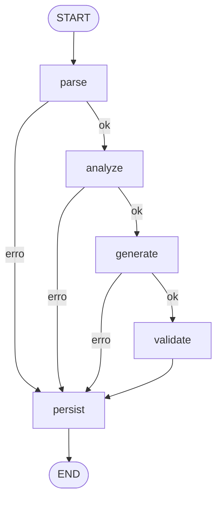

# Pipeline híbrida PL/pgSQL → Python

Moderniza uma stored procedure PL/pgSQL em um módulo Python. O fluxo é um grafo LangGraph: parsing e análise por regras, geração por LLM a partir do IR, validação estática e persistência de todo desfecho.



## Como executar

Requisitos: Python 3.12+ e Docker.

```bash
python -m venv .venv
.venv/Scripts/python -m pip install -e ".[dev]"
cp .env.example .env
```

Suba o Postgres e a API:

```bash
docker compose up --build
```

A API fica em `http://localhost:2024`. O health não consulta o banco.

```bash
curl http://localhost:2024/health
curl -X POST http://localhost:2024/modernize \
  -H "Content-Type: application/json" \
  -d "{\"source_code\": \"$(cat fixtures/fn_saldo_cliente.sql)\"}"
```

Testes, sem chave de LLM e sem rede:

```bash
.venv/Scripts/python -m pytest
.venv/Scripts/python -m ruff check src tests
```

Com `OPENAI_API_KEY` no `.env` e o Postgres no ar, a métrica dos anexos B–F grava `results/`:

```bash
.venv/Scripts/python -m modernize.evaluation.runner
```

`POST /evaluate` devolve a mesma métrica.

## Decisões

O parser é o pglast, o parser do PostgreSQL. `parse_sql` lê o envelope da rotina e `parse_plpgsql` lê o corpo. O restante da pipeline só enxerga um IR próprio. sqlglot cobre mal cursor, `EXCEPTION` e `GET DIAGNOSTICS`. sqlparse só tokeniza.

A geração delega agregação, `UPDATE` em massa e CTE recursiva ao PostgreSQL, via psycopg, na conexão que o chamador passa. Controle, validação e `RAISE` ficam em Python. A função gerada não abre conexão e não dá `commit`. Reescrever a CTE do anexo F ou o cursor do anexo E em loop Python aumentaria a chance de divergência. O cursor vira uma leitura do conjunto motor e uma leitura das taxas, com casamento em memória.

`NULL <> 'ATIVA'` no anexo D não entra no `IF` do PL/pgSQL. A tradução não pode usar `!=` do Python, porque `None != "ATIVA"` é verdadeiro. O `INSERT` de erro desse anexo está na mesma transação do `RAISE`, então o legado perde o log. A função aceita `audit_conn`: preenchido, o log sobrevive; ausente, o efeito do legado permanece. O relatório marca essa divergência.

O período inválido do anexo F está no mesmo bloco do `WHEN OTHERS`. A função devolve a linha de fallback e não propaga. `saldo_consolidado` não acumula os meses. A entrega preserva a fórmula.

O servidor é o LangGraph CLI. `langgraph.json` publica o grafo e um app FastAPI com `GET /health` e `POST /modernize`. O health nativo do servidor é `GET /ok` e não substitui o endpoint pedido.

A métrica Fidelidade de Contrato mede, em cada anexo, parse do Python (0,35), símbolo e parâmetros (0,25), comentário `DECISION` para cada risco (0,20) e presença das operações SQL (0,20). A nota agregada é a média simples das cinco rotinas. Ela não prova que a função produz o mesmo efeito da procedure.

Runtime local e da imagem Docker: Python 3.13. O código gerado evita sintaxe exclusiva de 3.14 e continua válido nas duas versões.

Bibliotecas: langgraph e langgraph-cli para o grafo e o servidor; fastapi para o contrato HTTP; pydantic para o IR e o pedido; pglast para o parse; psycopg para o histórico e para o SQL gerado; openai para a geração com `OPENAI_BASE_URL`; langfuse para o span de cada nó quando as chaves existem; ruff para o projeto e para o Python gerado.

## Limitações

Sem `OPENAI_API_KEY`, a geração persiste `falha` e responde HTTP 200. Fonte vazia é HTTP 422 e não entra no grafo. Falha de pipeline com histórico gravado também é HTTP 200; HTTP 500 fica para banco indisponível.

A métrica não compara resultado contra o banco legado. O database `legacy` sobe vazio para essa evolução. Temperatura 0 não torna o modelo determinístico entre versões. Só PL/pgSQL passa do parser. Health não verifica o Postgres. Sem fila, o cliente espera o tempo do modelo.

Langfuse fica desligado sem `LANGFUSE_PUBLIC_KEY` e `LANGFUSE_SECRET_KEY`. O self-hosted oficial pode apontar para `LANGFUSE_HOST`. A captura de tela entra no README depois de uma execução com as chaves configuradas.

Com mais tempo: massa no database `legacy` e comparação de efeito; cache por hash da fonte, do schema, do modelo e da política; fila para tirar a geração do request; outro dialeto atrás da mesma porta de parser.

## Variáveis

| Variável | Função |
| --- | --- |
| `DATABASE_URL` | Postgres do histórico |
| `OPENAI_API_KEY` | provedor da geração |
| `OPENAI_BASE_URL` | endpoint compatível com a API OpenAI |
| `OPENAI_MODEL` | modelo, default `gpt-4.1` |
| `LANGFUSE_PUBLIC_KEY` | chave pública |
| `LANGFUSE_SECRET_KEY` | segredo |
| `LANGFUSE_HOST` | URL do Langfuse |
